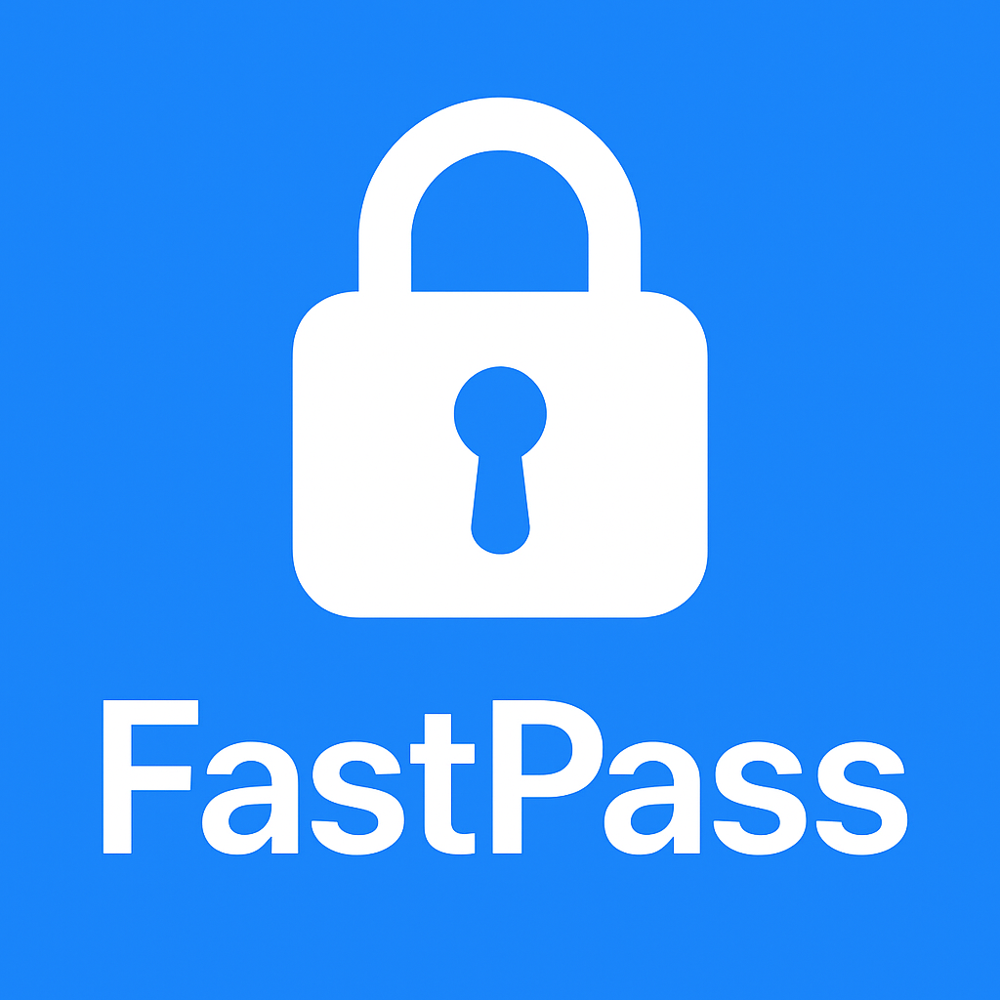
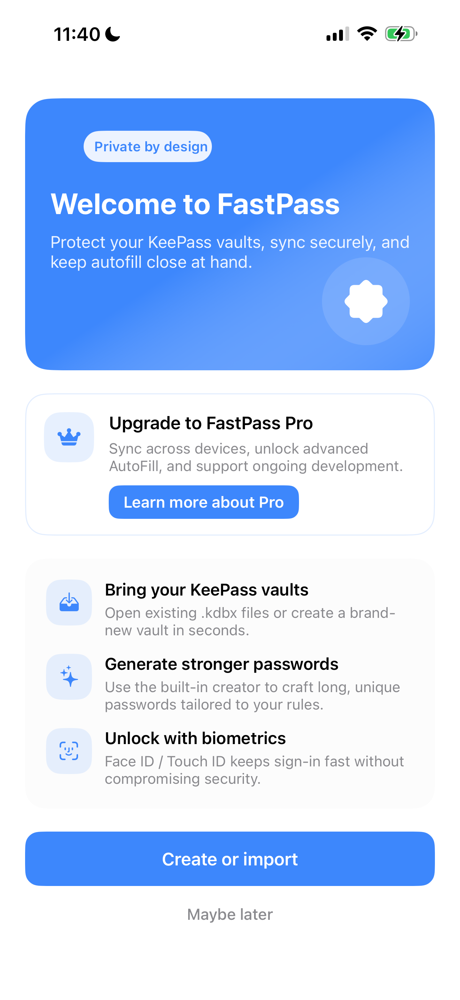
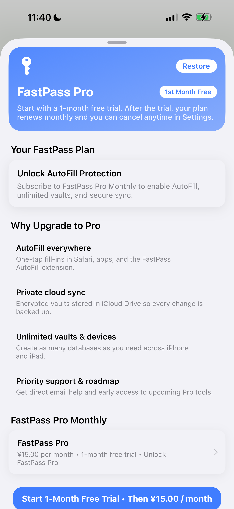
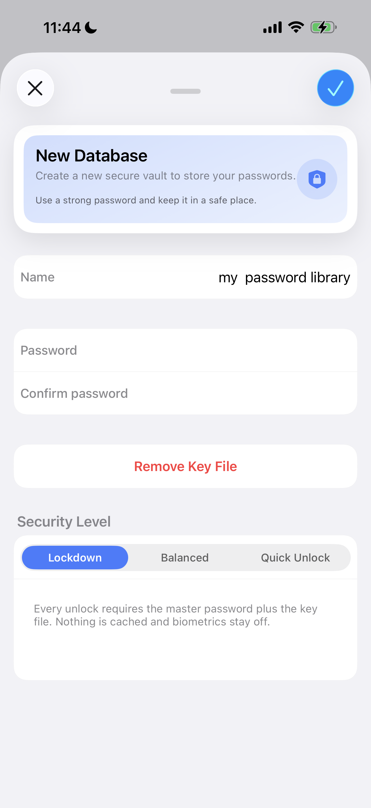
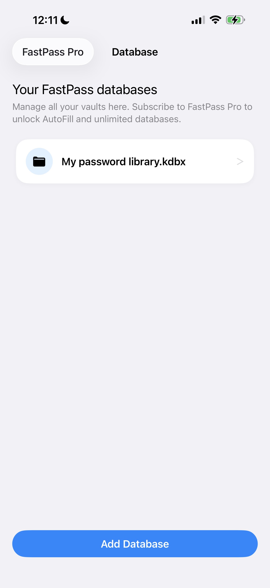
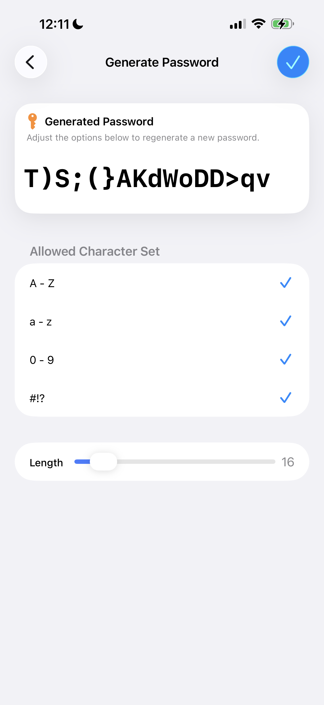
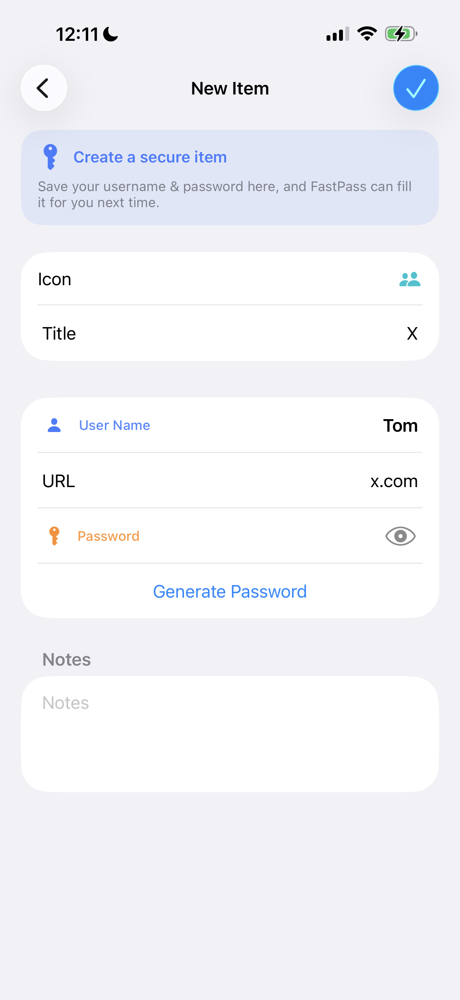

# SwiftFastPass

[English](README.md) | 简体中文

**SwiftFastPass** 是一款面向 iOS 的本地离线密码管理器（全开源），使用 KeePassKit 读写 `.kdbx` 数据库，支持主密码 + 密钥文件加密、生物识别解锁、自动剪贴板清理、密码生成器等能力。
应用完全离线，不上传任何数据，适合希望在 iOS 上使用 Keepass 体系的用户。

> 📌 **SwiftFastPass 已全面重构 UI（2025）**：
> 引入卡片式界面、圆角列表、阴影分层、统一视觉规范、全新密码生成器 UI、改进的 LockView/Onboarding/Paywall 页面等。

本仓库包含完整 App 源码、测试代码及全部依赖配置（CocoaPods / Carthage）。

---









# ✨ 功能亮点

### 🔐 安全 & 加密

* **本地加密存储**，完全离线，不采集隐私数据
* **主密码 + 密钥文件** 组合加密
* **安全等级策略**：依据 `.kdbx` 文件安全等级自动设置 Keychain `SecAccessControl`
* **生物识别解锁**：Face ID / Touch ID，可自由启用或关闭

### 🧩 AutoFill（即将支持）

你最近规划的路线图已纳入 README：

* 支持系统级密码自动填充（AutoFill Credential Provider）
* 支持自动读取 App Group 中的加密 Credential Snapshot
* 通过扩展将 KeePass Entry 自动注册为 iOS 可填充密码

（详细的 AutoFill 开发路线图见下方）

### 🔑 密码使用体验

* 内置 **密码生成器**（大小写/数字/符号/长度滑块）
* 支持 **密码放大显示**
* 自动清理剪贴板（提升安全）
* URL 域名自动提取，用于自动填充匹配
* Entry 图标支持 KeePass 原生图标

### 🎨 全新 UI（2025 重构）

为提升易读性与现代感，你已为几乎所有页面进行了升级：

* 卡片式设计（Card-style Sheet）
* Row 增加阴影/圆角/分层背景
* Hero Header 新增渐变底板、图标、统一标题规范
* Character Set 面板改为圆角卡片
* Onboarding badge 样式重构
* Paywall 页面统一 UI & 订阅状态卡片
* LockView 更明显的输入区域与布局

### 🌏 完整本地化

* **英文 / 简体中文（zh-Hans）**
* 所有文案在 `Base.lproj / en.lproj / zh-Hans.lproj` 中完全同步
* UI 文本、订阅页面文案已与新版本保持一致

---

# 📁 目录结构

```
SwiftFastPass/                # App 源码（UI、Models、Utils、PasswordCreator、AutoFillStore 等）
SwiftFastPassAutoFill/        # 即将上线的 AutoFill Extension 目录（WIP）
SwiftFastPassTests/           # 单元测试
SwiftFastPassUITests/         # UI 自动化测试
Pods/、Carthage/              # 三方依赖
Assets.xcassets/              # 图标与资源
Base.lproj/ en.lproj/ zh-Hans.lproj/ # 国际化
```

---

# 📦 依赖与工具

* Xcode 15+ / Swift 5+
* **CocoaPods**：SnapKit、MenuItemKit、Eureka 等
* **Carthage**：KeePassKit 所需框架

---

# 🔧 环境准备

```bash
pod install
carthage bootstrap --platform iOS --use-xcframeworks
```

使用 `.xcworkspace` 打开。

---

# ▶️ 构建与运行

```bash
xcodebuild -workspace SwiftFastPass.xcworkspace \
           -scheme SwiftFastPass \
           -destination "platform=iOS Simulator,name=iPhone 15"
```

---

# 🧪 测试

```bash
xcodebuild test -workspace SwiftFastPass.xcworkspace \
                -scheme SwiftFastPass \
                -destination "platform=iOS Simulator,name=iPhone 15"
```

* 新增功能需补至少一条单元测试
* UI 改动需补 UITest 截图确认

---

# 💳 订阅（Pro）开发说明

你当前 AppStoreConnect 配置的订阅为：

* **FastPass Pro – 月付**
* 产品 ID：`com.huchengzhen.swiftfastpass.pro.monthly`

并且确认了 Apple 的规则：

> **首个订阅必须绑定到一个全新的 App 版本一起审核**
> 上传新 Build → App 内购买项目 → 勾选订阅 → 一起提交审核。

付费页面使用全新卡片 UI + Hero Header。
订阅状态卡片内容已与 StoreKit 2 API 适配。

### TestFlight 测试订阅

* 使用 **Sandbox Account 登录**（iOS 17 不再有“退出沙盒账号”按钮，需在 App Store → 头像 → 退出）
* 订阅在 Sandbox 环境价格为 0 且立即续期（加速测试）

---

# 🔧 AutoFill Extension 路线图

你最近确定的实现步骤整理如下：

### 1. 添加 App Group + AutoFill Entitlement

在主 app 与 extension 各自的 *.entitlements 内添加：

* `com.apple.security.application-groups` → `group.com.huchengzhen.swiftfastpass`
* `com.apple.developer.authentication-services.autofill-credential-provider`

### 2. 新增共享存储 Helper：`AutoFillCredentialStore.swift`

* 将 KeePass Entry 转成可填充 snapshot（uuid/title/username/password/domain）
* 使用 `AppGroup` 路径写入 Encrypted Plist
* 所有 Entry 变更（新增/删除/修改）都要同步写入

### 3. 在 extension 中读取 snapshot

* 按 domain 做关联
* 支持用户在 Safari / App 输入密码时自动匹配

### 4. 注册可填充标识符

使用 `ASCredentialIdentityStore.shared.save()`
自动把所有 snapshot 注册进系统密码数据库。

---

# 🧩 开发规范

* 使用 **4 空格缩进**，大括号同行
* 避免文件过大，将 UI / Logic / Model 拆分
* `final class` 优先
* 本地化文案必须三语言同步更新
* 所有新 UI 遵循 FastPass 2025 卡片式视觉规范
* 订阅文案使用 `NSLocalizedString` 包装
* Keychain 策略位于 `FileSecretStore`

---

# 🔐 安全指引

* 不要在仓库提交证书或私钥
* 敏感配置从 Build Settings / Xcode Environment 注入
* Keychain 使用严格的 `SecAccessControl.biometryCurrentSet`
* 仅暴露必要的 objc bridging header

---

# 🤝 贡献

欢迎提 Issue / PR。

PR 需包含：

1. 改动说明与关联 issue
2. UI 改动需附截图
3. 确认 `xcodebuild test` 通过

---

# 📜 许可证 License

SwiftFastPass 采用 **GNU GPLv3** 授权，与 KeePassKit 保持一致。

* 任何发布的 App（二进制）也必须遵循 GPL
* 修改后的版本必须保持相同许可证
* 发布时需包含完整 License 声明

英文版：

> SwiftFastPass is distributed under GPLv3 to remain compatible with KeePassKit.
> Using or redistributing the project implies acceptance of GPLv3 terms.
